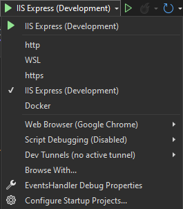
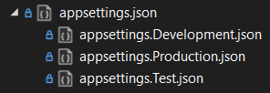
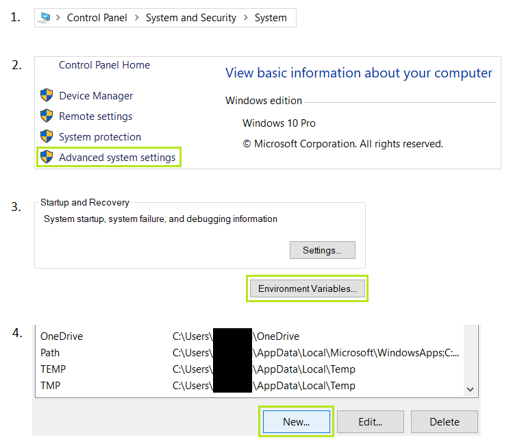
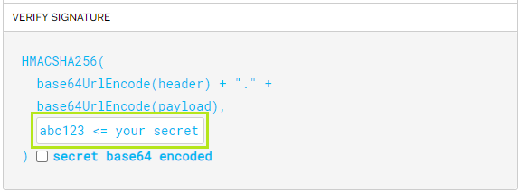
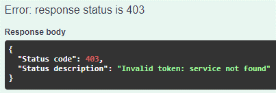
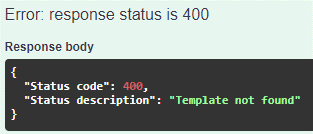
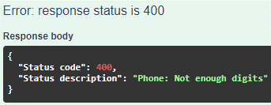

# OMC Documentation

v.1.6.6.1

© 2024, Worth Systems.

---
# 1. Introduction

**OMC (Output Management Component)** is a central point and the common hub of the communication workflow between third parties software such as:

- **Open Notificatie** (API web service)
- **Open Zaak** (API web service)
- **Open Klant** (API web service)
- **Notify NL** (API web service)

## 1.1. Swagger UI

Since the **OMC** project is just an API, it would not have any user friendly graphic representation if used as a standalone RESTful ASP.NET Web API project.

That's why **ASP.NET** projects are usually exposing a UI presentation layer for the convenience of future users (usually developers). To achieve this effect, we are using so called [Swagger UI](https://swagger.io/tools/swagger-ui/), a standardized **HTML**/**CSS**/**JavaScript**-based suite of tools and assets made to generate visualized API endpoints, API documentation, data models schema, data validation, interaction with user (API responses), and other helpful hints on how to use the certain API.

Swagger UI can be accessed just like a regular webpage, or when you are starting your project in your IDE (preferably Visual Studio).

**NOTE**: Check the section dedicated to [requests authorization](#swagger-ui-authorization) when using **Swagger UI**.

### 1.1.1. Using web browser

The URL to **Swagger UI** can be recreated in the following way:

- [Protocol*] + [Domain**] + `/swagger/index.html`

For example: https://omc.acc.notifynl.nl/swagger/index.html

\* Usually https
\** Where your Web API application is deployed

### 1.1.2. Using IDE (Visual Studio)

Select one of the launch **profiles** to start **Swagger UI** page in your browser (which will be using `/localhost:`).

In `launchSettings.json` file, remember to always have these lines incuded in the launch **profile** you are going to use for running the API with **Swagger UI**:

---
# 2. Architecture

---
# 3. Required environment variables

## 3.1. Different configurations

> **OMC API** and related sub-systems (e.g., **Secrets Manager**) are using mix of configurations:

- `appsettings.json` (for public configurations, which are not meant to vary between customers/instances of OMC)

- `environment variables` (for sensitive configurations and/or customizable per customers/instances of OMC):

| Name*                               | Type   | Example                         | Is sensitive | Validation                                                                                                                                 | Notes                                                                                                                                                                                                                 |
| ----------------------------------- | ------ | ------------------------------- | ------------ | ------------------------------------------------------------------------------------------------------------------------------------------ | --------------------------------------------------------------------------------------------------------------------------------------------------------------------------------------------------------------------- |
| OMC_AUTHORIZATION_JWT_SECRET        | string | abcd123t2gw3r8192dewEg%wdlsa3e! | true         | Cannot be missing and have null or empty value                                                                                             | For security reasons it should be at least 64 bytes long                                                                                                                                                              |
| OMC_AUTHORIZATION_JWT_ISSUER        | string | OMC                             | true         | Cannot be missing and have null or empty value                                                                                             | Something identifying Notify NL (OMC Web API) service (it will be used internally) - The OMC is the issuer                                                                                                            |
| OMC_AUTHORIZATION_JWT_AUDIENCE      | string | OMC                             | true         | Cannot be missing and have null or empty value                                                                                             | Something identifying Notify NL (OMC Web API) service (it will be used internally) - The OMC is the audience                                                                                                          |
| OMC_AUTHORIZATION_JWT_EXPIRESINMIN  | int    | 60                              | true         | Cannot be missing and have null or empty value                                                                                             | The OMC JWT tokens are generated by OMC and authorized by Open services. New JWT token has to be generated manually, using OMC dedicated library, if the token validity expire (by default it is 60 minutes)          |
| OMC_AUTHORIZATION_JWT_USERID        | string | tester                          | false        | Cannot be missing and have null or empty value                                                                                             | The OMC JWT tokens are generated by OMC and authorized by Open services. New JWT token has to be generated manually, using OMC dedicated library, if the token validity expire (by default it is 60 minutes)          |
| OMC_AUTHORIZATION_JWT_USERNAME      | string | Charlotte Sanders               | false        | Cannot be missing and have null or empty value                                                                                             | The OMC JWT tokens are generated by OMC and authorized by Open services. New JWT token has to be generated manually, using OMC dedicated library, if the token validity expire (by default it is 60 minutes)          |
| ---                                 | ---    | ---                             | ---          | ---                                                                                                                                        | ---                                                                                                                                                                                                                   |
| OMC_API_BASEURL_NOTIFYNL            | string | https://api.notify.nl           | false        | Cannot be missing and have null or empty value                                                                                             | The domain where your Notify API instance is listening (e.g.: "https://api.notifynl.nl")                                                                                                                              |
| ---                                 | ---    | ---                             | ---          | ---                                                                                                                                        | ---                                                                                                                                                                                                                   |
| USER_AUTHORIZATION_JWT_SECRET       | string | abcd123t2gw3r8192dewEg%wdlsa3e! | true         | Cannot be missing and have null or empty value                                                                                             | Internal implementation of Open services is regulating this, however it's better to use something longer as well                                                                                                      |
| USER_AUTHORIZATION_JWT_ISSUER       | string | Open Services                   | true         | Cannot be missing and have null or empty value                                                                                             | Something identifying OpenZaak / OpenKlant / OpenNotificatie services (token is shared between of them)                                                                                                               |
| USER_AUTHORIZATION_JWT_AUDIENCE     | string | OMC                             | true         | Cannot be missing and have null or empty value                                                                                             | Something identifying OMC web API service (it will be used internally) - The OMC is the audience                                                                                                                      |
| USER_AUTHORIZATION_JWT_EXPIRESINMIN | int    | 60                              | true         | Cannot be missing and have null or empty value                                                                                             | This JWT token will be generated from secret, and other JWT claims, configured from UI of OpenZaak API web service. Identical details (secret, iss, aud, exp, etc) as in Open services needs to be used here          |
| USER_AUTHORIZATION_JWT_USERID       | string | admin                           | false        | Cannot be missing and have null or empty value                                                                                             | This JWT token will be generated from secret, and other JWT claims, configured from UI of OpenZaak API web service. Identical details (secret, iss, aud, exp, etc) as in Open services needs to be used here          |
| USER_AUTHORIZATION_JWT_USERNAME     | string | Municipality of Rotterdam       | false        | Cannot be missing and have null or empty value                                                                                             | This JWT token will be generated from secret, and other JWT claims, configured from UI of OpenZaak API web service. Identical details (secret, iss, aud, exp, etc) as in Open services needs to be used here          |
| ---                                 | ---    | ---                             | ---          | ---                                                                                                                                        | ---                                                                                                                                                                                                                   |
| USER_API_KEY_NOTIFYNL               | string | name-8-4-4-4-12-8-4-4-4-12      | true         | Cannot be missing and have null or empty value + must be in name-UUID-UUID format + must pass Notify NL validation                         | It needs to be generated from "NotifyNL" Admin Portal                                                                                                                                                                 |
| USER_API_KEY_OBJECTEN               | string | 56abcd24e75c02d44ee...          | true         | Cannot be missing and have null or empty value                                                                                             | It needs to be generated from Objecten web UI                                                                                                                                                                         |
| ---                                 | ---    | ---                             | ---          | ---                                                                                                                                        | ---                                                                                                                                                                                                                   |
| USER_DOMAIN_OPENNOTIFICATIES        | string | opennotificaties.mycity.nl      | false        | Cannot be missing and have null or empty value + only domain should be used: without protocol (http / https) or endpoints (.../api/create) | You have to use ONLY the domain part from URLs where you are hosting the dedicated Open services                                                                                                                      |
| USER_DOMAIN_OPENZAAK                | string | openzaak.mycity.nl              | false        | Cannot be missing and have null or empty value + only domain should be used: without protocol (http / https) or endpoints (.../api/create) | You have to use ONLY the domain part from URLs where you are hosting the dedicated Open services                                                                                                                      |
| USER_DOMAIN_OPENKLANT               | string | openklant.mycity.nl             | false        | Cannot be missing and have null or empty value + only domain should be used: without protocol (http / https) or endpoints (.../api/create) | You have to use ONLY the domain part from URLs where you are hosting the dedicated Open services                                                                                                                      |
| USER_DOMAIN_OBJECTEN                | string | objecten.mycity.nl              | false        | Cannot be missing and have null or empty value + only domain should be used: without protocol (http / https) or endpoints (.../api/create) | You have to use ONLY the domain part from URLs where you are hosting the dedicated Open services                                                                                                                      |
| USER_DOMAIN_OBJECTTYPEN             | string | objecttypen.mycity.nl           | false        | Cannot be missing and have null or empty value + only domain should be used: without protocol (http / https) or endpoints (.../api/create) | You have to use ONLY the domain part from URLs where you are hosting the dedicated Open services                                                                                                                      |
| ---                                 | ---    | ---                             | ---          | ---                                                                                                                                        | ---                                                                                                                                                                                                                   |
| USER_TEMPLATEIDS_SMS_ZAAKCREATE     | string | 8-4-4-4-12                      | false        | Cannot be missing and have null or empty value + must be in UUID format                                                                    | Should be generated per specific business use case from "NotifyNL" Admin Portal                                                                                                                                       |
| USER_TEMPLATEIDS_SMS_ZAAKUPDATE     | string | 8-4-4-4-12                      | false        | Cannot be missing and have null or empty value + must be in UUID format                                                                    | Should be generated per specific business use case from "NotifyNL" Admin Portal                                                                                                                                       |
| USER_TEMPLATEIDS_SMS_ZAAKCLOSE      | string | 8-4-4-4-12                      | false        | Cannot be missing and have null or empty value + must be in UUID format                                                                    | Should be generated per specific business use case from "NotifyNL" Admin Portal                                                                                                                                       |
| USER_TEMPLATEIDS_EMAIL_ZAAKCREATE   | string | 8-4-4-4-12                      | false        | Cannot be missing and have null or empty value + must be in UUID format                                                                    | Should be generated per specific business use case from "NotifyNL" Admin Portal                                                                                                                                       |
| USER_TEMPLATEIDS_EMAIL_ZAAKUPDATE   | string | 8-4-4-4-12                      | false        | Cannot be missing and have null or empty value + must be in UUID format                                                                    | Should be generated per specific business use case from "NotifyNL" Admin Portal                                                                                                                                       |
| USER_TEMPLATEIDS_EMAIL_ZAAKCLOSE    | string | 8-4-4-4-12                      | false        | Cannot be missing and have null or empty value + must be in UUID format                                                                    | Should be generated per specific business use case from "NotifyNL" Admin Portal                                                                                                                                       |

\* Copy-paste the *environment variable* name and set the value of respective type like showed in the **Example** column from the above.

**NOTE**: All of the configurations are required and validated whether they are null or empty. If you need to skip some `envionment variable` just use a value containing an empty space `" "`.

### 3.1.1. How to get some of these environment variables

`OMC_AUTHORIZATION_JWT_SECRET` - To be generated from passwords manager. Like other **OMC_AUTHORIZATION_[...]** configurations it's meant to be set by the user.

`USER_AUTHORIZATION_JWT_SECRET` - Like other **USER_AUTHORIZATION_[...]** configurations to be configured and set by the user after logging to OpenZaak API web service.

`USER_API_KEY_NOTIFYNL` - To be generated from "NotifyNL" Admin Portal => **API Integration** section.

`USER_TEMPLATEIDS_SMS_ZAAKCREATE` - All **Template IDs** (SMS and Email) will be generated (and then you can copy-paste them into environment variables) when the user create (one-by-one) new templates from "NotifyNL" Admin Portal => **Templates** section.

## 3.2. Setting environment variables

1. On Windows:

2. On Linux:

> To be finished...

3. On Mac:

> To be finished...

## 3.3. Using HELM Charts

**NotifyNL** and **OMC** are meant to be used with [HELM Charts](https://helm.sh/) (helping to install them on your machine).

- [NotifyNL HELM Charts (GitHub)](https://github.com/Worth-NL/helm-charts)

- [OMC HELM Charts (GitHub)](https://github.com/Worth-NL/helm-charts/tree/main/notifynl-omc)

---
# 4. Authorization and authentication

**JSON Web Token (JWT)** can be generated using:

- **SecretsManager.exe** from `CLI` (e.g., `CMD.exe on Windows`. **NOTE:** Do not use `PowerShell`)

- **SecretsManager.dll** from the code (public methods)

> To learn more, read the documentation dedicated to [Secrets Manager](https://github.com/Worth-NL/NotifyNL-OMC/blob/update/Documentation/EventsHandler/Logic/SecretsManager/Readme.md).

- External **https://jwt.io** webpage.

## 4.1. Example of required JSON Web Token (JWT) components

> Knowing all required *environment variables* you can fill these claims manually and generate your own JWT tokens without using **Secrets Manager**. This approach might be helpful if you are using **OMC** API web service only as a Web API service (**Swagger UI**), during testing its functionality from **Postman**, or when using only the **Docker Image**.

### 4.1.1. Header (algorithm + type)

> {
  "alg": "HS256",
  "typ": "JWT"
}

### 4.1.2. Payload (claims)

> {
  "client_id": "",
  "user_id": "",
  "user_representation": "",
  "iss": "",
  "aud": "",
  "iat": 0000000000,
  "exp": 0000000000
}

### 4.1.3. Signature (secret)

> **NOTE:** To be filled in **https://jwt.io**.

## 4.2. Mapping of JWT claims from environment variables

| JWT claims            | OMC Environment Variables                |
| --------------------- | ---------------------------------------- |
| `client_id`           | `OMC_AUTHORIZATION_JWT_ISSUER`           |
| `user_id`             | `OMC_AUTHORIZATION_JWT_USERID`           |
| `user_representation` | `OMC_AUTHORIZATION_JWT_USERNAME`         |
| `iss`                 | `OMC_AUTHORIZATION_JWT_ISSUER`           |
| `aud`                 | `OMC_AUTHORIZATION_JWT_AUDIENCE`         |
| `iat`                 | To be filled manually using current time |
| `exp`                 | `OMC_AUTHORIZATION_JWT_EXPIRESINMIN`     |
| `secret`              | `OMC_AUTHORIZATION_JWT_SECRET`           |

> **NOTE:** "iat" and "exp" times requires Unix formats of timestamps.
The Unix timestamp can be generated using [Unix converter](https://www.unixtimestamp.com/).

## 4.3. Using generated JSON Web Token (JWT)

### 4.3.1. Postman

> After generating the JWT token you can copy-paste it in **Postman** to authorize your HTTP requests.

---
<h3 id="swagger-ui-authorization">4.3.2. Swagger UI</h3>

> If you are using **OMC** **Swagger UI** from browser (graphic interface for **OMC** API web service) then you need to copy the generated token in the following way:

And then click "Authorize".

---
# 5. Workflow (business logic cases)

---
# 6. Errors

List of **validation** (format, requirements), **connectivity** or business logic **processing** errors that you might encounter during accessing **OMC** API endpoints.

## 6.1. Events Controller

Endpoints:

- `POST` .../Events/Listen
- `GET` .../Events/Version

#### 6.1.2. Possible errors

> To be finished...

---
## 6.2. Notify Controller

Endpoints:

- `POST` .../Notify/Confirm

#### 6.2.1. Possible errors

> To be finished...

---
## 6.3. Test Controller

### 6.3.1. Testing Notify

Endpoints:

- `GET` .../Test/Notify/HealthCheck
- `POST` .../Test/Notify/SendEmail
- `POST` .../Test/Notify/SendSms

#### 6.3.1.1. Possible errors

##### a) Common for ...Test/SendEmail + ...Test/SendSms:

- Invalid base URL ("NotifyNL" API service):

- Invalid format of API key or it is missing ("NotifyNL" API service):

- Invalid API key - it was not registered for this "NotifyNL" API service:

- Template UUID is invalid:

- Template not found:

- Missing required personalization (or the default “example” was used):

##### b) ...Test/SendEmail:

- Missing required parameters:

- Email is empty (only whitespaces):

- Email is invalid (missing @, dot, domain, etc.):

##### c) ...Test/SendSms:

- Missing required parameters:

- Phone number is empty (only whitespaces):

- Phone number contains letters or symbols:

- Phone number contains not enough digits:

- Phone number contains too many digits:

- Phone number has incorrect format (e.g., country code is not supported):

### 6.3.2. Testing Open services

Endpoints:

- `POST` .../Test/Open/ContactRegistration

#### 6.3.2.1. Possible errors

> To be finished...