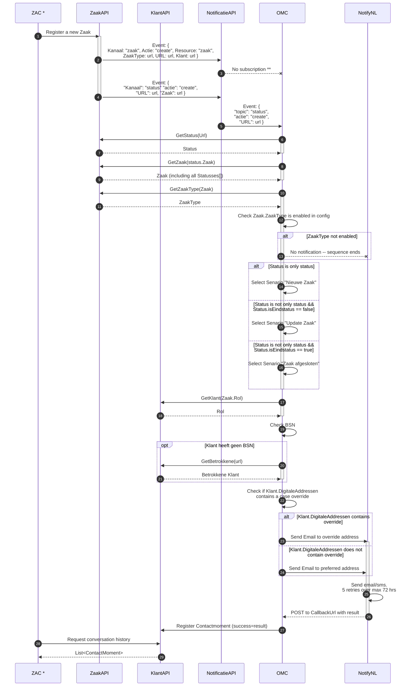

# OMC integration ZWG Stack

The Notify OMC is built to conntect a [Z(aak) G(ericht) W(erken)](https://vng.nl/projecten/zaakgericht-werken) environment as developed and defined by the Dutch Vereniging Nederlandse Gemeenten (VNG) to the Dutch [NotifyNL platform](https://admin.notifynl.nl) used for notifications. In short, this standard defines how organisations and municipalities store information around their Klanten (citizens) and their ongoing Zaken (cases) they have with these organisations. This OMC respects that living standard and is continually updated to facilitate additions and changes to that standard. 

## Functionality
This Output Manangment Component for ZGW can be used in any environment to automatially take care of all notification requirements as defined in the upcoming (january 2026) [Wet modernisering elektronisch bestuurlijk verkeer](https://www.digitaleoverheid.nl/overzicht-van-alle-onderwerpen/wetgeving/wet-modernisering-elektronisch-bestuurlijk-verkeer/). If your organisatation adheres to the ZGW standards and has deployed the following API's defined in that standard, this OMC automatically gets triggered to notify your klanten at relevant junctions. The links below point to reference implementations of the standards developed by Maykin, but one doesn't need to use the specific applications, as long as the API standards are adhered to. 

Definitive:
1. [ZaakAPI](https://zaken-api.vng.cloud/) - This api is used to retrieve registered cases
2. [CatalogiAPI](https://catalogi-api.vng.cloud/) - This api is used to retrieve statusses and types of cases 
3. [DocumentenAPI](https://documenten-api.vng.cloud/) - This api is used to retrieve and store documents
4. [BesluitenAPI](https://besluiten-api.vng.cloud/) - This api is used to retrieve all decisions for desicisions made that impact clients
5. [NotificatiesAPI](https://notificaties-api.vng.cloud/) - This api is used to put all systemnotifications onto and to broadcast those notifications to all subscribed services

In development:
1. [KlantAPI](https://openklant.test.notifynl.nl/klanten/) - Used to retrieve all client related data concerning preferences and contactinformation
2. [ObjectenAPI](https://objecten.test.notifynl.nl/) - A sandbox api environment to develop new objects onto before they are put on their own api or integrated into one of the other ones

## Triggers for OMC
The idea behind those registration api's is that anything that happens in business applications for that organisation, that it stores objects concerning those operations in the api's listed above. For example: Someone registers a complaint about noise in their appartment block, this gets registered in business software but it stores that complaint as a Zaak in the ZaakAPI with a ZaakType "Noise Complaint" and linked to a Klant in the KlantAPI referring to the person who complained. All these registrations carried out (CRUD operations mainly) all get registered on the NotificatieAPI as well ("Zaak Created" in this example). At this point other software that has a subscription on certain events on the NotificatiesAPI (so in this example a subscription on "Zaak Created" if the type is "Noise Complaint") get pinged that a new zaak was made. Our OMC is one of such pieces of software, when set up and configured with a subscription to listen for the events happening in the ZGW stack, it will kick off its logic to retrieve everything needed in order to take care of all notifications for that scenario as needed.

## Support
Currently the OMC supports six distinct scenarios for two types of clients, that you can link to NotifyNL templates in the configuration that you wish to use when that scenatio happens.

Scenarios:
1. New Case (Zaak Create) - A new case was created by or for a citizen
2. Case Updated (Zaak Update) - An existing case has received and update to it
3. Case Closed (Zaak Gesloten) - A case has been closed for whatever reason
4. New Decision (Besluit Create) - A decision was made that impacts a citizen somehow
5. New Task (Taak Create) - A task was assignet to a citizen to carry out
6. New Message (Bericht Create) - A new message was created for the user to be read in the Berichtenbox

Clients:
1. A real life client - Someone with a BSN 
2. A representative - So someone registered to be the contactperson for a company, could be a B.V. or ZZP or otherwise
3. Involved parties (in development) - Someone who is tasked to (help) take care of someone else's

## Zaak Created / Updated / Closed

*: Zac: Zaak Afhandel Comonent (some piece of software that can register, change, etc. cases for clients)  
**: Because of a race condition currently present in the ZGW stack we are listening for status updates on cases rather than the actual Zaak Create action 