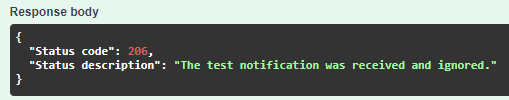
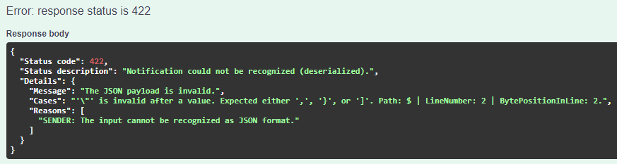
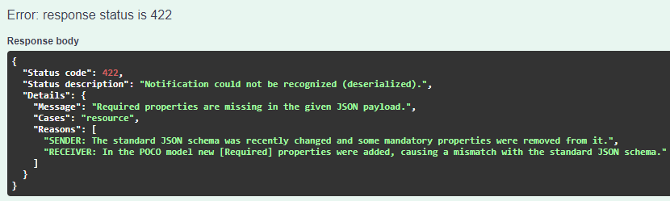
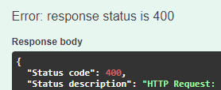
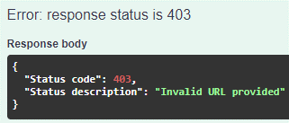
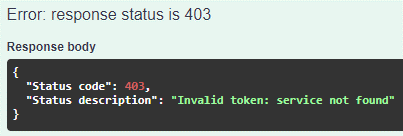
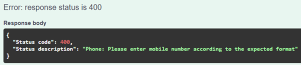

# Endpoints

All endpoints require a JWT Bearer token in the `Authorization` header unless noted otherwise.

```
Authorization: Bearer <token>
```

See [JWT tokens](../authentication/jwt-tokens.md) for how to generate a token.

The base path is configurable via `OMC_CONTEXT_PATH` (default: empty — OMC is served at the root). Swagger UI is available at `/swagger/index.html`.

---

## Events controller

### POST `/Events/Listen`

The main ingress endpoint. Open Notificaties POSTs events here when a case, object, or decision changes.

**Request body:** JSON notification event from the NotificatiesAPI.

```json
{
  "actie": "create",
  "kanaal": "zaken",
  "resource": "status",
  "kenmerken": {
    "zaaktype": "https://...",
    "bronorganisatie": "000000000",
    "vertrouwelijkheidaanduiding": "openbaar"
  },
  "hoofdObject": "https://...",
  "resourceUrl": "https://...",
  "aanmaakdatum": "2000-01-01T10:00:00.000Z"
}
```

**Responses:**

| Code | Meaning |
|---|---|
| `202 Accepted` | Event processed and notification sent (or processing accepted) |
| `206 Partial Content` | Test ping received, or event did not match any scenario — Open Notificaties will **not** retry |
| `401 Unauthorized` | Invalid or missing JWT token |
| `422 Unprocessable Entity` | Invalid JSON payload or missing required fields |
| `500 Internal Server Error` | Unhandled exception |
| `501 Not Implemented` | Implementation gap — should not occur in production |







### GET `/Events/Version`

Returns the current OMC version and the active workflow version.

---

## Notify controller

### POST `/Notify/Confirm`

Callback endpoint for NotifyNL delivery receipts. NotifyNL POSTs here after each notification delivery attempt (success or failure). OMC uses this to write contact moments to OpenKlant.

**Responses:**

| Code | Meaning |
|---|---|
| `202 Accepted` | Callback processed |
| `400 Bad Request` | HTTP error communicating with ZGW services (e.g. OpenKlant unavailable) |
| `422 Unprocessable Entity` | Invalid JSON payload |



---

## Test controller

Use these endpoints to verify your configuration before going live. All require a JWT Bearer token.

### GET `/Test/Notify/HealthCheck`

Verifies connectivity with the NotifyNL API.

### POST `/Test/Notify/SendEmail`

Sends a test email via NotifyNL.

**Possible errors:**

| Code | Cause |
|---|---|
| `403 Forbidden` | Invalid base URL, missing API key, or API key not registered in NotifyNL |
| `400 Bad Request` | Invalid template UUID, template not found, missing personalisation |





### POST `/Test/Notify/SendSms`

Sends a test SMS via NotifyNL.

**Phone number validation errors (400 Bad Request):**

- Empty or whitespace-only number
- Contains letters or symbols
- Too few digits
- Too many digits
- Unsupported country code format



### POST `/Test/OMC/Configuration`

Validates that all required environment variables are present and correctly formatted.

### POST `/Test/ZGW/Endpoints`

Validates connectivity with all configured ZGW service endpoints.

### POST `/Test/Open/ContactRegistration`

Tests writing a contact moment to OpenKlant.

---

## Error format

HTTP 400 errors from ZGW connectivity issues follow this pipe-delimited format:

```
OMC | <severity> | <error message> | <URL that was called> | <raw JSON response from service> | Notification: <original notification JSON>
```

> Note: Some ZGW services return error messages in Dutch. These are passed through verbatim from the upstream service.
