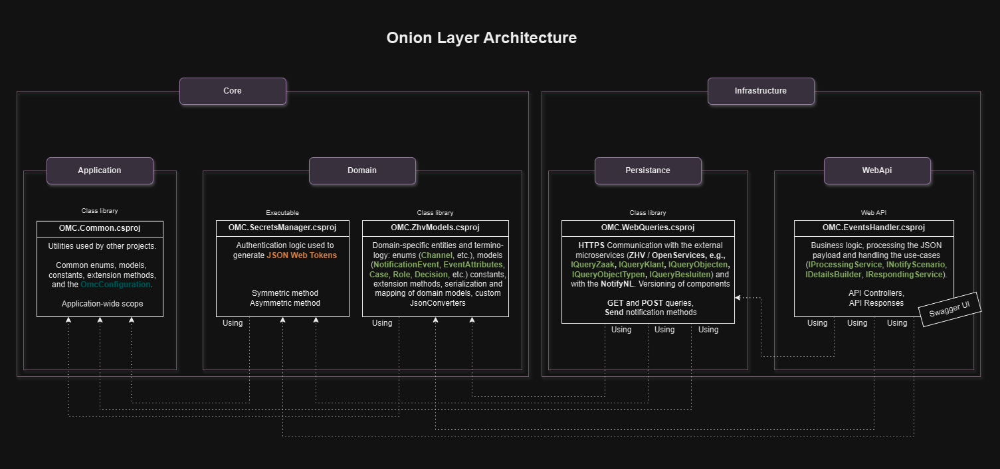

# Architecture overview

OMC is built on .NET 10 as an ASP.NET Core Web API, following Clean Architecture principles with a layered onion structure.

---

## Layers

| Layer | Project | Responsibility |
|---|---|---|
| **Domain** | `ZgwModels`, `SecretsManager` | ZGW API models, JWT token generation |
| **Application** | `Common` | Business logic, configuration, shared services |
| **Infrastructure — Persistence** | `WebQueries` | HTTP clients for all ZGW API calls |
| **Infrastructure — Web API** | `EventsHandler` | ASP.NET Core controllers, routing, DI wiring |

---

## Key design patterns

### Strategy Pattern — notification scenarios

Each of the six notification scenarios is implemented as a separate strategy. OMC selects the correct strategy at runtime based on the incoming event's action, channel, and resource. This makes scenarios independently testable and extensible without modifying shared code.

### Strategy Pattern — encryption

JWT token signing is abstracted behind `IJwtEncryptionStrategy`. At startup, either `SymmetricEncryptionStrategy` (HMAC, default) or `AsymmetricEncryptionStrategy` (RSA) is injected based on the `Encryption:IsAsymmetric` configuration.

### Adapter Pattern — query context

All outbound ZGW API calls are aggregated behind `IQueryContext` / `QueryContext`. This single interface gives all scenario strategies access to every available ZGW query method, while keeping the underlying HTTP implementation hidden and testable.

### Loader strategy — configuration fallback

When reading a configuration value, OMC first checks for an environment variable override, then falls back to `appsettings.json`. This is implemented as a loader strategy pattern, consistently applied across all settings. See [appsettings.json](../configuration/appsettings.md) for override naming conventions.

### Caching

Configuration values and frequently-used ZGW responses are cached in thread-safe concurrent dictionaries after first read, avoiding repeated calls to the same external endpoints within a single request lifecycle.

---

## Technology stack

| Component | Technology |
|---|---|
| Runtime | .NET 10 / ASP.NET Core |
| Error tracking | Sentry SDK |
| API documentation | Swashbuckle (Swagger/OpenAPI) |
| JWT | System.IdentityModel.Tokens.Jwt |
| Aspect-oriented concerns | PostSharp |
| NotifyNL client | Custom .NET SDK (v7.0.1+) |
| Container | Docker (ASP.NET 10 base image) |
| Deployment | Helm (Kubernetes) |
