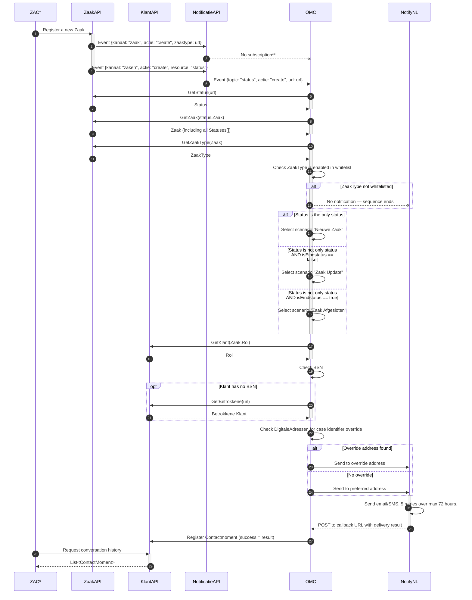

# ZGW integration

OMC is built to connect a [Zaakgericht Werken (ZGW)](https://vng.nl/projecten/zaakgericht-werken) environment — as developed and defined by the Dutch Vereniging Nederlandse Gemeenten (VNG) — to the [NotifyNL](https://admin.notifynl.nl) notification platform.

The ZGW standard defines how organisations and municipalities store information about their citizens (`klanten`) and their ongoing cases (`zaken`). OMC respects this living standard and is continuously updated to accommodate additions and changes.

---

## How events flow

Everything that happens in a ZAC (Zaak Afhandel Component — case management software) is registered in the ZGW APIs. For example: a citizen files a noise complaint, which is stored as a `zaak` in OpenZaak with `zaaktype` "Noise Complaint" and linked to a `klant` in OpenKlant.

Every CRUD operation on these registrations is also published as an event to the NotificatiesAPI. OMC holds a subscription on relevant event types. When a matching event arrives, OMC fetches all needed data and sends the notification.

---

## Zaak Created / Updated / Closed — sequence

\* **ZAC** — Zaak Afhandel Component: any software that creates or manages cases on behalf of citizens.

\*\* Due to a race condition in the ZGW stack, OMC subscribes to `status` events on the `zaken` channel rather than the `zaak` resource directly.

---

## Required ZGW APIs

| API | Standard | Used for |
|---|---|---|
| [ZaakAPI](https://zaken-api.vng.cloud/) | Definitive | Retrieve cases, statuses, case types |
| [CatalogiAPI](https://catalogi-api.vng.cloud/) | Definitive | Retrieve status types and case type metadata |
| [DocumentenAPI](https://documenten-api.vng.cloud/) | Definitive | Retrieve and store documents linked to decisions |
| [BesluitenAPI](https://besluiten-api.vng.cloud/) | Definitive | Retrieve decisions and their information objects |
| [NotificatiesAPI](https://notificaties-api.vng.cloud/) | Definitive | Event subscription and broadcast |
| KlantAPI / OpenKlant | Active development | Citizen contact details and preferences |
| ObjectenAPI | Active development | Tasks, messages, custom objects |
