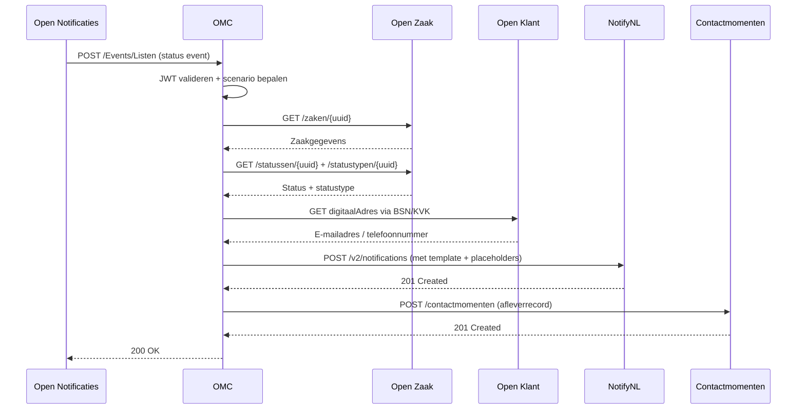

# ZGW Integratie

Het OMC integreert met de Nederlandse ZGW (Zaakgericht Werken) standaard, gedefinieerd door VNG Realisatie. ZGW beschrijft een set van API's voor zaakgericht werken bij overheidsinstanties.

---

## ZGW API's die het OMC gebruikt

| API | Doel | Authenticatie |
|---|---|---|
| **Open Notificaties** | Eventabonnementen en eventaflevering | JWT (inkomend) |
| **Open Zaak** (Zaken) | Zaakgegevens, statussen, zaaktypen | JWT (uitgaand) |
| **Open Zaak** (Besluiten) | Besluiten, besluittypen | JWT (uitgaand) |
| **Open Klant** | Contactgegevens burgers, digitale adressen | API-sleutel (v2) |
| **Objecten** | Taken, berichten, KTO-objecten | API-sleutel |
| **ObjectTypen** | Objecttype-definities | API-sleutel |
| **Contactmomenten / Klantinteracties** | Aflevergeschiedenis terugschrijven | JWT (uitgaand) |

---

## Sequentiediagram — Zaak aangemaakt/gewijzigd/afgesloten

---

## ZGW context

ZGW is de Nederlandse overheidsstandaard voor zaakgericht werken. De kernprincipes zijn:

- **Zaak** — een specifiek geval of verzoek dat door een overheidsinstantie wordt afgehandeld
- **Status** — de huidige fase in de afhandeling van een zaak
- **Besluit** — een formeel besluit gekoppeld aan een zaak
- **Klant** — een burger of organisatie die betrokken is bij een zaak
- **Contactmoment** — een registratie van een interactie met een klant

Het OMC fungeert als brug tussen deze ZGW-concepten en NotifyNL, waarbij alle notificatielogica wordt afgehandeld zonder dat NotifyNL directe toegang nodig heeft tot de ZGW-registraties.
