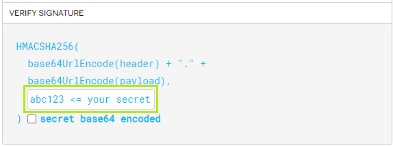
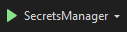
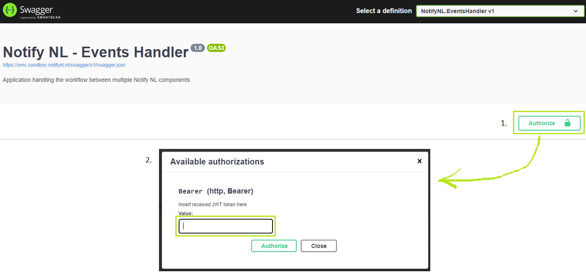
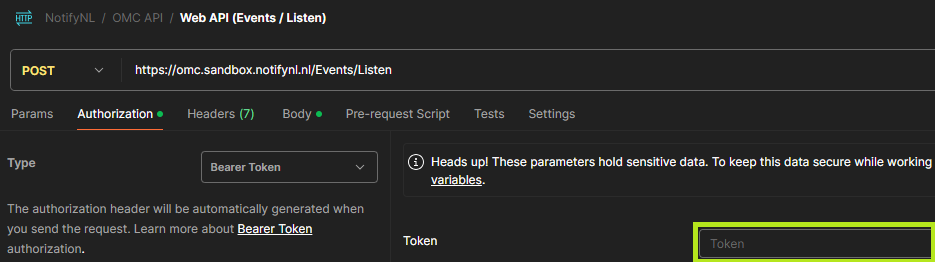
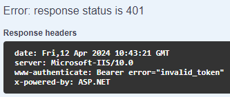
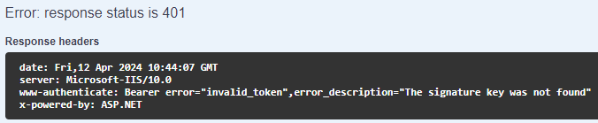

# JWT tokens

OMC uses JWT Bearer tokens to authenticate incoming requests. The same token format is used by Open Notificaties when sending events to OMC, and by developers accessing the API via Swagger UI or Postman.

OMC also generates its own JWT tokens internally to authenticate outbound requests to OpenZaak, using the `ZGW_AUTH_JWT_*` credentials.

---

## Token structure

A JWT consists of three parts: **Header**, **Payload**, and **Signature**.

### Header

```json
{
  "alg": "HS256",
  "typ": "JWT"
}
```

### Payload (claims)

```json
{
  "client_id": "",
  "user_id": "",
  "user_representation": "",
  "iss": "",
  "aud": "",
  "iat": 0000000000,
  "exp": 0000000000
}
```

### Claims mapping

| JWT claim | OMC environment variable | Notes |
|---|---|---|
| `client_id` | `OMC_AUTH_JWT_ISSUER` | Same value as `iss` |
| `user_id` | `OMC_AUTH_JWT_USERID` | |
| `user_representation` | `OMC_AUTH_JWT_USERNAME` | |
| `iss` | `OMC_AUTH_JWT_ISSUER` | |
| `aud` | `OMC_AUTH_JWT_AUDIENCE` | |
| `iat` | — | Unix timestamp of issuance — set manually |
| `exp` | — | `iat` + (`OMC_AUTH_JWT_EXPIRESINMIN` × 60) |
| Signature secret | `OMC_AUTH_JWT_SECRET` | |

> `iat` and `exp` use Unix timestamp format. Use a [Unix timestamp converter](https://www.unixtimestamp.com/) if generating tokens manually.

---

## Generating a token

### Option 1 — Secrets Manager (recommended)

Use the [Secrets Manager](secrets-manager.md) tool to generate a token from the configured environment variables:

```cmd
OMC.SecretsManager.exe 60
```

This generates a token valid for 60 minutes.

### Option 2 — jwt.io

Fill in the claims manually at [jwt.io](https://jwt.io) using the values from your `OMC_AUTH_JWT_*` environment variables.



### Option 3 — Visual Studio launch profile

If running locally, define the `OMC_AUTH_JWT_*` variables in your `launchSettings.json` profile and run the Secrets Manager project directly.



---

## Using the token

### Swagger UI

Click **Authorize** in the Swagger UI and enter:

```
Bearer <your-token>
```



### Postman

In the **Authorization** tab, select **Bearer Token** and paste the token.



### HTTP header

```
Authorization: Bearer <your-token>
```

---

## Token errors

> **HTTP 401 Unauthorized** — Invalid or expired JWT token. Regenerate the token and ensure the `OMC_AUTH_JWT_SECRET` matches what was used to sign it.



