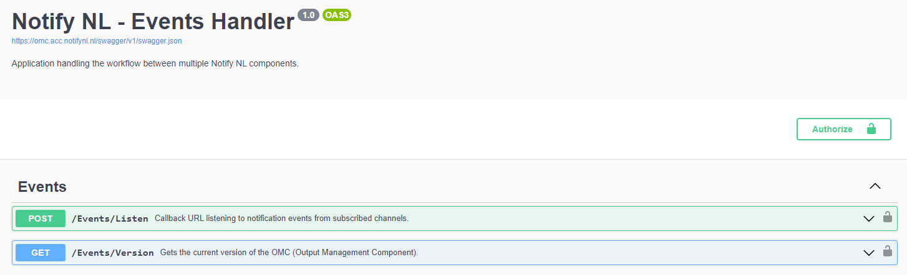

# Step 3 — Deploy and test OMC

---

## 3.1 Deploy with Helm

OMC is distributed as a Docker image and deployed via Helm chart. The chart is available to authorized users in the Worth-NL Helm chart repository.

Set all required environment variables in your Helm `values.yaml` or as Kubernetes secrets. At minimum you need:

```yaml
env:
  ASPNETCORE_ENVIRONMENT: "Production"

  OMC_AUTH_JWT_SECRET: ""
  OMC_AUTH_JWT_ISSUER: ""
  OMC_AUTH_JWT_AUDIENCE: ""
  OMC_AUTH_JWT_EXPIRESINMIN: "60"
  OMC_AUTH_JWT_USERID: ""
  OMC_AUTH_JWT_USERNAME: ""

  OMC_FEATURE_WORKFLOW_VERSION: "2"

  ZGW_AUTH_JWT_SECRET: ""
  ZGW_AUTH_JWT_ISSUER: ""
  ZGW_AUTH_JWT_EXPIRESINMIN: "60"
  ZGW_AUTH_JWT_USERID: ""
  ZGW_AUTH_JWT_USERNAME: ""

  ZGW_AUTH_KEY_OPENKLANT: ""
  ZGW_AUTH_KEY_OBJECTEN: ""
  ZGW_AUTH_KEY_OBJECTTYPEN: ""

  ZGW_ENDPOINT_OPENNOTIFICATIES: ""
  ZGW_ENDPOINT_OPENZAAK: ""
  ZGW_ENDPOINT_OPENKLANT: ""
  ZGW_ENDPOINT_BESLUITEN: ""
  ZGW_ENDPOINT_OBJECTEN: ""
  ZGW_ENDPOINT_OBJECTTYPEN: ""
  ZGW_ENDPOINT_CONTACTMOMENTEN: ""

  NOTIFY_API_BASEURL: "https://api.notifynl.nl"
  NOTIFY_API_KEY: ""

  # For initial testing, whitelist all case types with wildcard
  ZGW_WHITELIST_ZAAKCREATE_IDS: "*"
  ZGW_WHITELIST_ZAAKUPDATE_IDS: "*"
  ZGW_WHITELIST_ZAAKCLOSE_IDS: "*"
  ZGW_WHITELIST_TASKASSIGNED_IDS: "*"
  ZGW_WHITELIST_DECISIONMADE_IDS: "*"
  ZGW_WHITELIST_MESSAGE_ALLOWED: "false"
```

> `"*"` as a whitelist value accepts all case types. Replace with specific case type identifiers (`zaaktypeIdentificatie`) once you have confirmed the integration works.

For the full list of environment variables see [Environment variables](../configuration/environment-variables.md).

---

## 3.2 Generate a JWT token for testing

To call OMC's health check endpoints you need a JWT Bearer token. Generate one using the [Secrets Manager](../authentication/secrets-manager.md) tool or manually via [jwt.io](https://jwt.io) using the `OMC_AUTH_JWT_*` credentials.

See [JWT tokens](../authentication/jwt-tokens.md) for the full claims structure.

---

## 3.3 Run health checks

Once OMC is running, verify connectivity with all ZGW services using the test endpoints. Add the JWT token as a Bearer header (`Authorization: Bearer <token>`).

```
POST /Test/OMC/Configuration
POST /Test/ZGW/Endpoints
GET  /Test/Notify/HealthCheck
POST /Test/Notify/SendEmail
POST /Test/Notify/SendSms
```

A `200 OK` response from each confirms that OMC can reach all configured services. A Postman collection (NotifyNL-workspace) is available from Worth Systems for running these checks.

See [Endpoints](../api-reference/endpoints.md) for full endpoint documentation.

---

## 3.4 Verify with a test case

Create a new case in your ZGW environment linked to a citizen who has an email address registered in your NotifyNL team or guest list. If OMC is subscribed to events (Step 4) and the callback is configured (Step 5), you should see:

1. A notification event appear in Open Notificaties directed at OMC
2. OMC return a `200 OK` (or `202 Accepted`) to Open Notificaties
3. The notification appear in the NotifyNL admin portal under API activity

---

## 3.5 Swagger UI

OMC exposes a Swagger UI for interactive API exploration:

```
https://<your-omc-domain>/swagger/index.html
```

Available in both `Development` and `Production` environments. Requires a valid JWT Bearer token — see [JWT tokens](../authentication/jwt-tokens.md).


