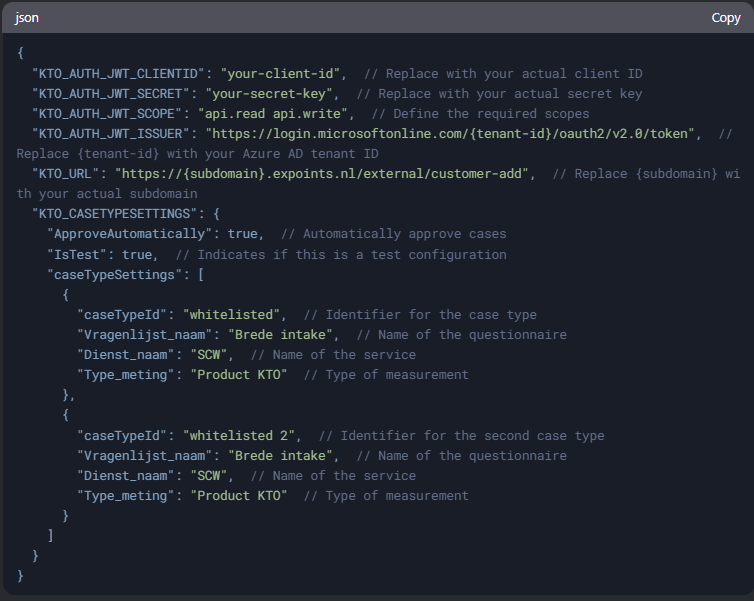

# KTO / Expoints

Het OMC ondersteunt integratie met de KTO (Klanttevredenheidsonderzoek) Expoints-dienst. Na het afsluiten van een zaak kan het OMC automatisch een klanttevredenheidsonderzoek versturen.

---

## Hoe het werkt

1. Het scenario **Zaak afgesloten** wordt geactiveerd
2. Het OMC controleert of het zaaktype is geconfigureerd in `KTO_CASETYPESETTINGS`
3. Als het zaaktype overeenkomt, verstuurt het OMC een KTO-uitnodiging via de Expoints API
4. De burger ontvangt een uitnodiging voor het klanttevredenheidsonderzoek

---

## Configuratie

Stel alle KTO-variabelen in op `-` als de integratie niet wordt gebruikt.

| Variabele | Beschrijving |
|---|---|
| `KTO_BASEURL` | Basis-URL van de KTO Expoints-dienst |
| `KTO_APIKEY` | API-sleutel voor de KTO-dienst |
| `KTO_CASETYPESETTINGS` | JSON-object dat zaaktype-UUID's koppelt aan KTO-enquête-instellingen |

---

## KTO_CASETYPESETTINGS indeling

```json
{
  "https://openzaak.mijnstad.nl/catalogi/api/v1/zaaktypen/uuid-1": {
    "surveyId": "123",
    "questionnaireId": "456"
  },
  "https://openzaak.mijnstad.nl/catalogi/api/v1/zaaktypen/uuid-2": {
    "surveyId": "789",
    "questionnaireId": "012"
  }
}
```

Alleen zaaktypen die in dit JSON-object voorkomen, activeren een KTO-uitnodiging bij afsluiting.

---

## Voorbeeld KTO-instellingen


