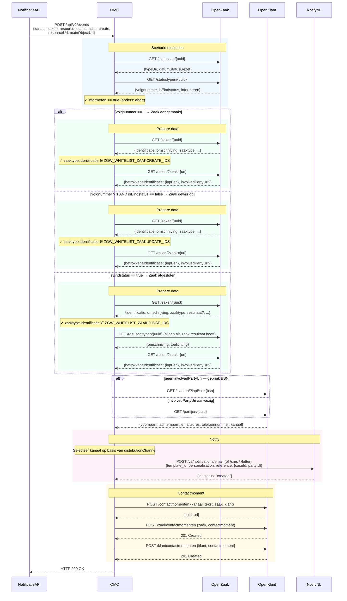

# Zaak aangemaakt

Dit scenario wordt geactiveerd wanneer een nieuwe zaak voor een burger of organisatie wordt geopend.

---

## Triggercondities

Het OMC activeert dit scenario wanneer een event binnenkomt met de volgende kenmerken:

| Veld | Vereiste waarde |
|---|---|
| `kanaal` | `zaken` |
| `resource` | `status` |
| `actie` | `create` |

---

## Sequence diagram

Het onderstaande diagram toont de volledige call flow voor alle drie zaakscenario's. Het **Zaak aangemaakt** pad wordt gevolgd wanneer `volgnummer == 1`.



---

## Verwerkingslogica

Nadat het event is ontvangen, haalt het OMC de statusgegevens op en controleert de volgende condities **in volgorde**. Als één conditie niet klopt, wordt de verwerking afgebroken.

### Stap 1 — Statustype ophalen

Het OMC haalt het statustype op via de `typeUri` van de ontvangen status.

### Stap 2 — Volgnummer check

```
statustype.volgnummer == 1
```

Alleen de **eerste** status op een zaak activeert dit scenario. Als het volgnummer hoger is, wordt het event overgeslagen (en mogelijk opgepakt door [Zaak gewijzigd](zaak-gewijzigd.md) of [Zaak afgesloten](zaak-afgesloten.md)).

### Stap 3 — Informeren check

```
statustype.isEindstatus == false  (impliciet: volgnummer 1 is nooit eindstatus)
statustype.informeren == true
```

Het statustype in Open Zaak moet het veld `informeren` op `true` hebben staan. Als dit `false` is, verstuurt het OMC geen notificatie voor dit statustype.

### Stap 4 — Whitelist check

```
zaaktype.identificatie ∈ ZGW_WHITELIST_ZAAKCREATE_IDS
```

Het zaaktype van de zaak moet voorkomen in de geconfigureerde whitelist. Gebruik `*` om alle zaaktypen toe te staan.

### Stap 5 — Gegevens ophalen

Het OMC haalt aanvullende gegevens op:

1. `GET /zaken/{uuid}` — zaakgegevens
2. `GET /zaaktypen/{uuid}` — zaaktype (voor whitelist check)
3. Contactgegevens van de burger via OpenKlant (BSN of KVK)

### Stap 6 — Notificatie versturen

Het OMC verstuurt de notificatie via NotifyNL met het geconfigureerde template en schrijft daarna een contactmoment terug naar OpenKlant.

---

## Vereisten samengevat

| Conditie | Waarde |
|---|---|
| `statustype.volgnummer` | `1` |
| `statustype.informeren` | `true` |
| `zaaktype.identificatie` | Moet op whitelist staan |
| Burger heeft contactgegevens | E-mail of telefoonnummer in OpenKlant |

---

## Beschikbare templateplaceholders

| Placeholder | Bron | Beschrijving |
|---|---|---|
| `((zaak.identificatie))` | zaak | Zaaknummer |
| `((zaak.omschrijving))` | zaak | Omschrijving van de zaak |
| `((zaak.startdatum))` | zaak | Startdatum van de zaak |
| `((status.omschrijving))` | statustype | Omschrijving van de huidige status |
| `((klant.voornaam))` | klant | Voornaam van de klant |
| `((klant.voorvoegselAchternaam))` | klant | Tussenvoegsel van de klant |
| `((klant.achternaam))` | klant | Achternaam van de klant |
| `((klant.emailadres))` | klant | E-mailadres van de klant |

---

## Relevante omgevingsvariabelen

| Variabele | Beschrijving |
|---|---|
| `ZGW_WHITELIST_ZAAKCREATE_IDS` | Kommagescheiden lijst van toegestane zaaktype-identificaties, of `*` |
| `NOTIFY_TEMPLATEID_EMAIL_ZAAKCREATE` | NotifyNL template-UUID voor e-mail |
| `NOTIFY_TEMPLATEID_SMS_ZAAKCREATE` | NotifyNL template-UUID voor sms |
| `NOTIFY_TEMPLATEID_LETTER_ZAAKCREATE` | NotifyNL template-UUID voor brief |
